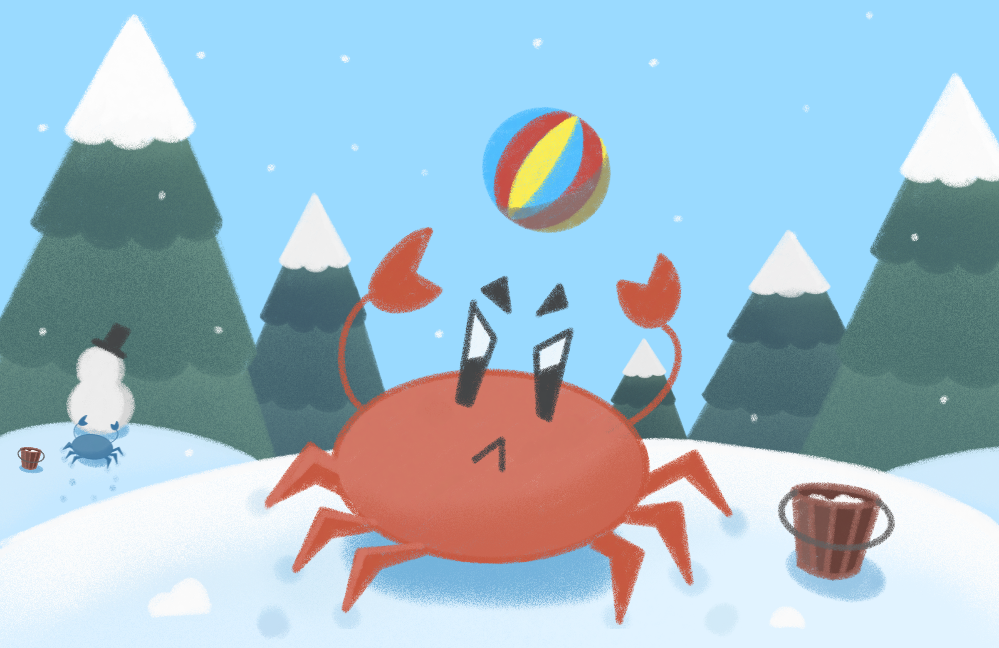

# Une journée à la plage



"Une journée à la plage" is a multiplayer mini-game created for the Fantasia ["Un été neigeux !"](https://itch.io/jam/-la-game-jam-2025-un-t-neigeux-) game jam!

Challenge climate cooling with your friends at the beach!

Try to build your snowman despite climate anomalies disturbing the ecosystem.
Be careful, you also need to protect your creation to win the game.

Controls:

[Z/Q/S/D] to move
[Space] to jump

Created by :

Han
Jrmgx
Joël Wurtz
Thibault Lenclos

Made with [Godot](https://godotengine.org/)

## Commands

Build and run the dedicated server server :

```bash
make docker-run-server
```

Build all the platforms :

```
make build-all
```
